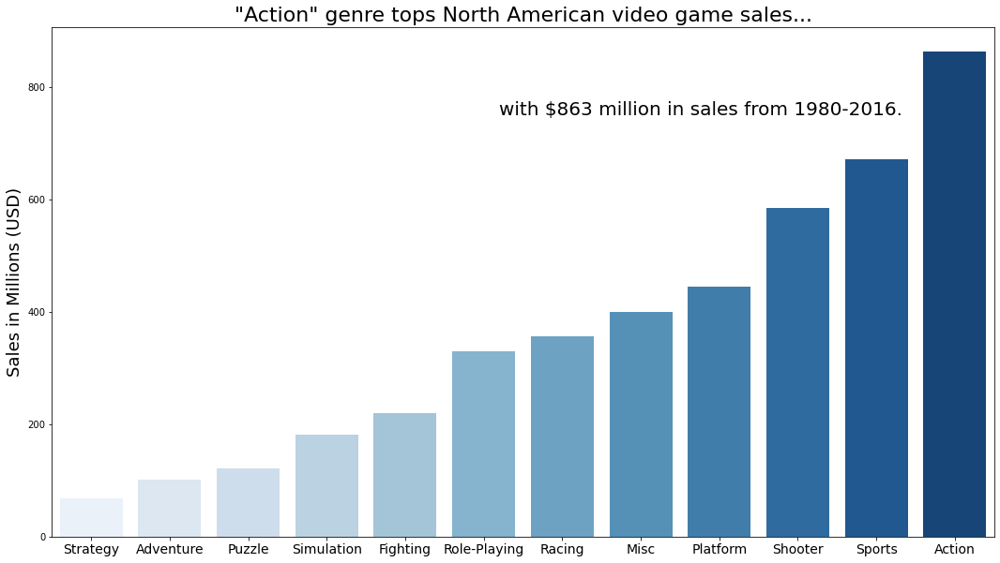
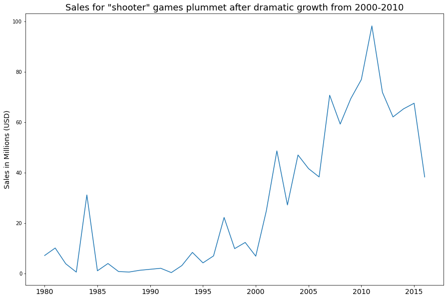

# Mini Exploratory Data Analysis of Video Game Sales
#### By Stetson Done

  
## Summary

  
>**Note**: This analysis is serving as an example of how jupyter notebooks, markdown, and html can be used together to create and share data projects. 

### Sources
  
The data for this analysis can be found at https://www.kaggle.com/datasets/stetsondone/video-game-sales-by-genre.

### Key Insights

Before beginning the exploratory data analysis, we posed two questions:

1. What have been the best performing genres in all of North America?

Based on this visualization, we learned that action, sports, and shooter video games are the most popular in North America. 
  
2. What has been the trend of sales for shooter games from 1990-2016. 
  

